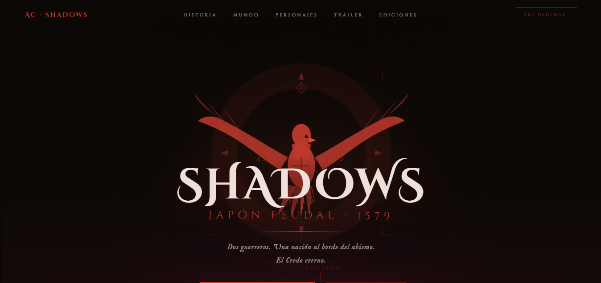

# 🗡️ Assassin's Creed: Shadows — Página de Aterrizaje

> Página web fan-made inspirada en **Assassin's Creed: Shadows**, ambientada en el Japón Feudal de 1579. Diseño oscuro y cinematográfico con animaciones fluidas y estética de alto impacto visual.

---

## 📸 Vista previa

<!-- Reemplaza con una captura de pantalla real del proyecto -->


---

## ✨ Características

- **Hero section** con logotipo animado tipo águila (SVG) y efecto parallax al mover el ratón
- **Navbar** con scroll adaptativo y subrayado animado en los enlaces
- **Secciones temáticas**: mundo, personajes, tráiler, ediciones y plataformas
- **Reproductor de vídeo** personalizado con overlay de play/pause
- **Tarjetas de personajes** (Naoe y Yasuke) con ilustraciones SVG propias
- **Grid de ediciones** (Standard / Gold / Collector's) con precios y beneficios
- **Scroll reveal** animado con `IntersectionObserver`
- **Efecto de grano** cinematográfico en toda la página
- **Totalmente responsive** con tipografía fluida (`clamp`)
- **Sin dependencias externas** de JavaScript — solo HTML, CSS y JS vanilla

---

## 🚀 Uso

No requiere instalación ni build. Simplemente clona el repositorio y abre el archivo en tu navegador:

```bash
git clone https://github.com/tu-usuario/ac-shadows-landing.git
cd ac-shadows-landing
open index.html
```

> **Nota:** Para que el tráiler funcione, coloca tu archivo de vídeo en `assets/video.mp4`.

---

## 📁 Estructura del proyecto

```
ac-shadows-landing/
├── index.html          # Página principal (todo en un solo archivo)
├── assets/
│   ├── video.mp4       # Vídeo del tráiler (no incluido)
│   └── preview.png     # Captura de pantalla para el README
└── README.md
```

---

## 🛠️ Tecnologías utilizadas

| Tecnología | Uso |
|---|---|
| HTML5 semántico | Estructura del contenido |
| CSS3 (variables, animaciones, clip-path) | Estilos y efectos visuales |
| JavaScript Vanilla | Interactividad sin librerías |
| SVG inline | Ilustraciones y logotipo del águila |
| Google Fonts | Cinzel Decorative, Cinzel, IM Fell English |
| IntersectionObserver API | Animaciones al hacer scroll |

---

## 🎨 Paleta de colores

| Token | Color | Hex |
|---|---|---|
| `--gold` | Rojo Assassin | `#c0392b` |
| `--gold-bright` | Rojo brillante | `#e74c3c` |
| `--cream` | Crema oscura | `#f0e0da` |
| `--dark` | Negro profundo | `#080508` |
| `--blood` | Sangre | `#8a1a1a` |

---

## ⚙️ Funcionalidades JavaScript

- **Navbar scroll:** aplica clase `.scrolled` al pasar 80px de desplazamiento
- **Parallax del águila:** sigue el movimiento del cursor con `mousemove`
- **Tráiler:** play/pause con overlay personalizado; se reinicia al terminar
- **Scroll reveal:** los elementos con clase `.reveal` aparecen al entrar en viewport
- **Smooth scroll:** los anchors del nav hacen scroll suave a las secciones

---

## 📋 Secciones de la página

1. **Hero** — Título animado, logotipo del Credo y llamada a la acción
2. **El Mundo** — Estadísticas del mapa: 96 km², 4 estaciones, 200+ locaciones
3. **Personajes** — Naoe (shinobi) y Yasuke (samurái)
4. **Tráiler** — Reproductor de vídeo embebido
5. **Ediciones** — Standard ($59.99), Gold ($89.99), Collector's ($199.99)
6. **Plataformas** — PS5, Xbox Series X|S, PC (Ubisoft Connect), Amazon Luna
7. **Footer** — Rating M, enlaces legales y aviso de propósito ilustrativo

---

## ⚠️ Aviso legal

Este proyecto fue creado con **fines ilustrativos y de diseño**. Assassin's Creed y todos los elementos relacionados son propiedad de **© Ubisoft Entertainment**. Este repositorio no tiene afiliación oficial con Ubisoft.

---

## 📄 Licencia

[MIT](LICENSE) — Libre para uso personal y educativo.
